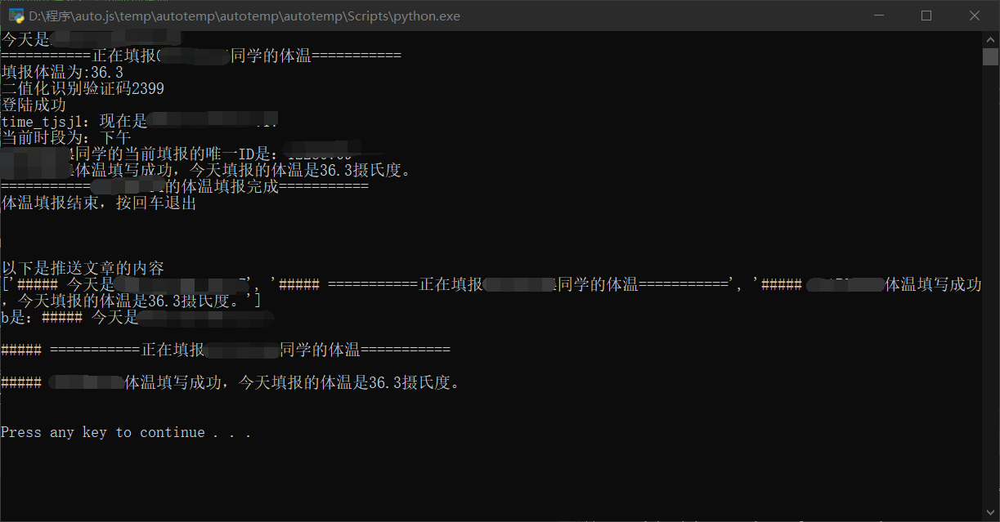
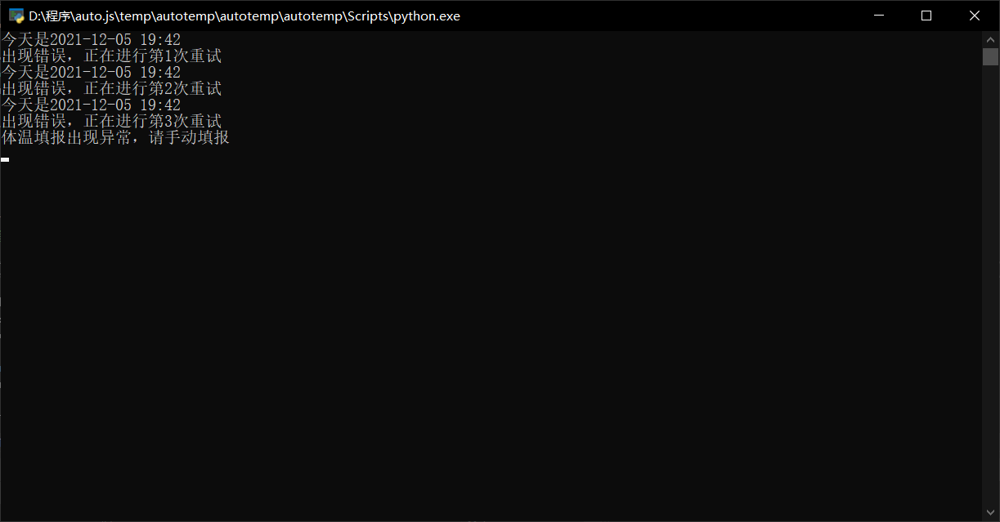

# SUES-autotemp

上海工程技术大学体温自动填报脚本,可部署到云服务器上，支持 Server 酱推送功能

# 运行截图

- 成功
  

- 失败
  

# 使用教程

python 版本`3.7.0`

- **安装**

  `pip install -r requirements.txt`

- **配置脚本**

修改以下代码内容,多用户请将账号密码一一对应

```
classnums = ['学号1', '学号2', '学号3']  # 填写学号
passages = [('密码1'), ('密码2'), ('密码3')] # 填写密码
sckey = "sckey"  # 非必填，Server酱推送提醒，需要填写sckey，官网：https://sct.ftqq.com/sendkey
```

- **运行**

  `python autotemp.py`

# 更新日志

- 2021/12/8
  更换验证码识别方式，通过将图片二值化进行识别，移除 easyocr，识别准确率高达 99.99%!同时大幅缩小体积。
- 2021/12/5
  更新验证码识别

# 其他说明

源代码来自于网络，但是帖子已被删除，在其基础上更新了验证码识别功能。
验证码识别功能参考自[sues-os](https://github.com/zsqw123/sues-os)
